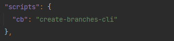

## Installation

```
npm i create-branches-cli
```

## Usage example

1) You need to add the script to package.json. 
In the screenshot, the desired screen is ```cb``` (short for create branches)



2) You need to create a ```cbconfig.json``` in the root of the project

```
EXAMPLE:
{
  "branch_name_template": "<task_type>/<project_name>-<task_id>-<task_name>",
  "project_names": "CHATPOINT",
  "task_types": ["feature", "bugfix", "hotfix"],
  "task_name_delimiter": "_",
  "autoCheckout": true
}

TYPES: 
{
  branch_name_template: string;
  project_names: string | string[];
  task_types: string | string[];
  task_name_delimiter?: string;
  autoCheckout?: boolean;
}
```
3) Сall ```npm run cb``` in the terminal

## Config Parameters

1) ### ```branch_name_template```

- meaning: The structure by which the branch name will be generated
- available properties (Determines which questions will be asked when creating a branch): 
  
    - ```<task_type> ```
    - ```<project_name>```
    - ```<task_id> ```
    - ```<task_name>```


2) ### ```project_names```
- meaning: If the value is ```string```, then this value will be substituted by default, if - ```string[]``` - becomes a list for selection

3) ### ```task_types```
- meaning: Answer options when choosing the type of task


4) ### ```task_name_delimiter```
- meaning: When answering the question about the name of the task, you can use a space or any other separator, but when forming a command, the name of the task will be divided by the specified character (by default, underscore ```_```)

5) ### ```auto_checkout```
- meaning: If the value is true, ```git checkout -b ${branch_name}``` will be executed, if false - ```git branch ${branch_name}```


## Notes

- It is not necessary to use all the properties in ```branch_name_template```

- If, when forming a branch name, you skip any of the input steps (namely water, and not selection from the list), then this property will be excluded from the final branch name